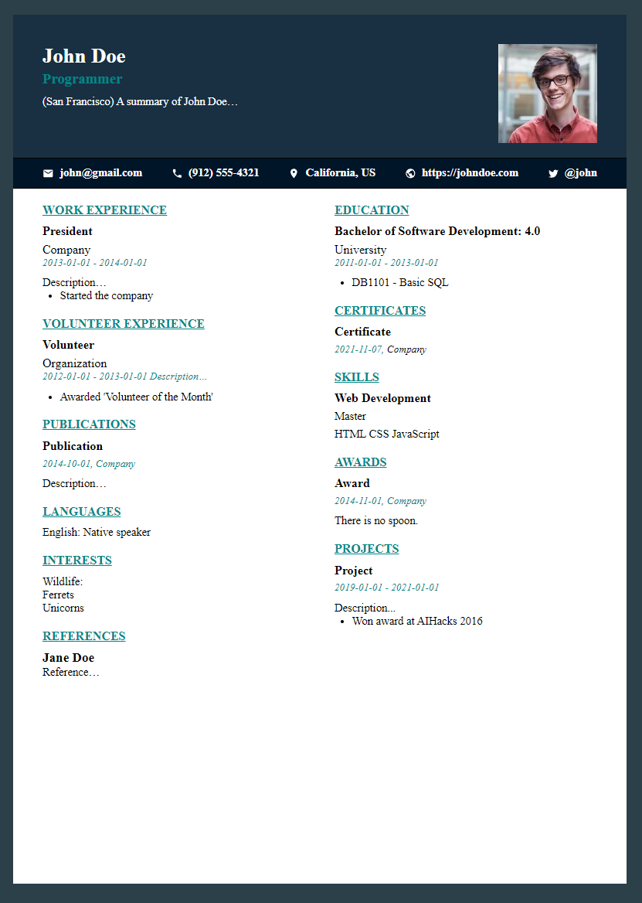

# Json portfolio

A few years ago I didn't know how to create stylish documents with Word, so I made a small web project to print my CV from a custom json file.

Today, I redid the project using Astro, Sass and typescript following the oficial JSON resume schema.

[JSON Resume Schema](https://jsonresume.org/schema/) \
[Astro framework](https://astro.build/)

